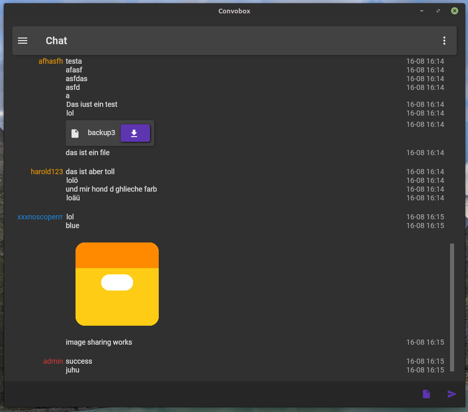
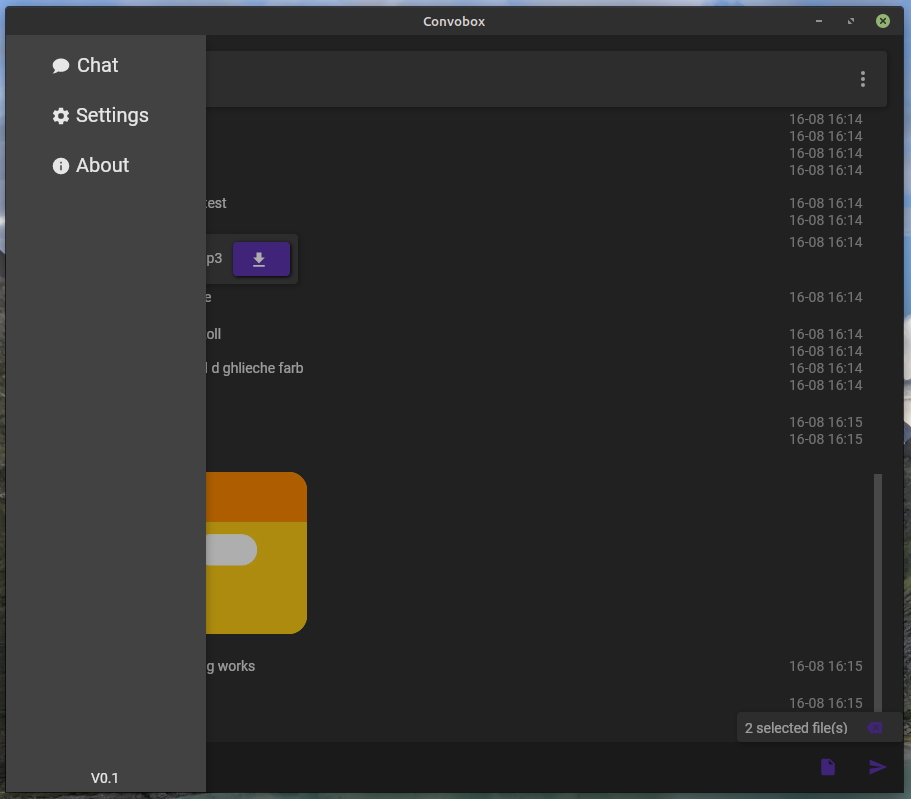
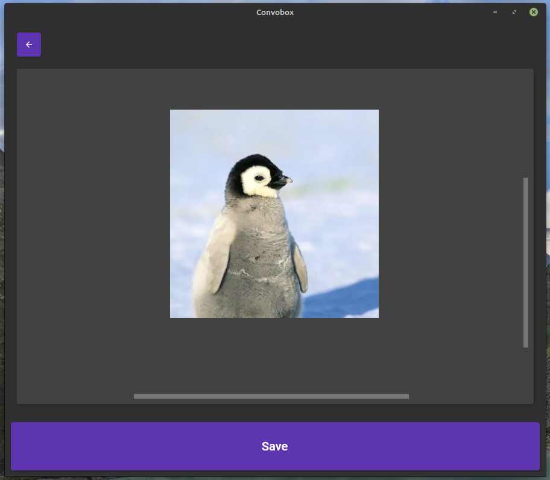
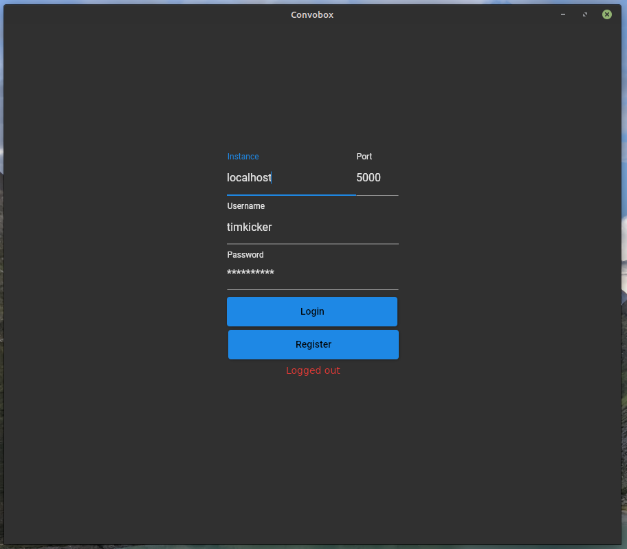
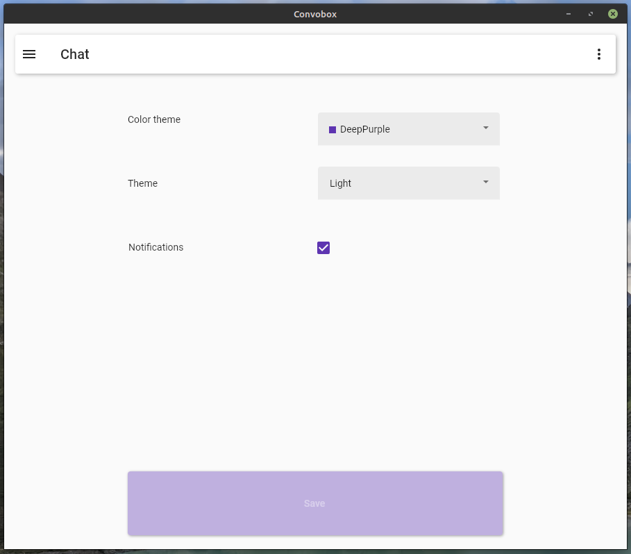

# Convobox

Convobox is an open-source chat project that provides a server and client solution for cross-platform chat applications. With Convobox, you can host your own chat servers and connect to various servers from the client interface.

## Features

- **Cross-Platform**: Convobox is built using Avalonia C# .NET Core, making it compatible with Windows, macOS, Linux, iOS and Android.
- **Security**: Messages are encrypted, Accounts stored accordingly (Hash, salt, pepper,...), Prevent SQLInjections,...
- **Server Hosting**: You can easily set up and host your own Convobox chat servers.
- **Multi-Server Support**: The Convobox client allows you to connect to multiple chat servers, making it easy to manage and switch between conversations.
- **Real-Time Messaging**: Enjoy real-time chat messaging with friends and colleagues. Also get the last 100 messages when logging in, with the option on requesting more of the history.
- **User Authentication**: Secure your chat servers with user authentication to control access.
- **Customization**: Convobox is highly customizable, allowing you to tailor server and client settings to your specific needs.
- **Client Theming**: Multiple colors and dark/light theme.

## Screenshots

.| .
:-------------------------:|:-------------------------:
  |  
  |  
  | 

## Installation

At the time of writing, the project has to be compiled from source. You are also able to use the provided docker image.

## Contributing

I welcome contributions from the community! If you want to contribute to Convobox, please feel free to open a pull request!

